# Sizzle

We have created a food ordering and review system website.
In this we can Sign Up/Login both as customers and restaurant owners.
For beginning we added Cash On Delivery, which can easily be extended to other payment methods.
As Restaurants Owners we can add or delete Dishes or can even update Restaurant Info.
As customers after ordering food we can give Review and Ratings.

# Features Implemented

## Frontend

We have a full responsive HTML and CSS frontend with a litle JS.
All the pages and features are implemented and liniked according to best User-Experience.

## Backend

We have implemented Signup User Functionality and Review-Rating giving facility.
We have written all CRUD routes but can't link\render pages accordingly.

# Screenshots

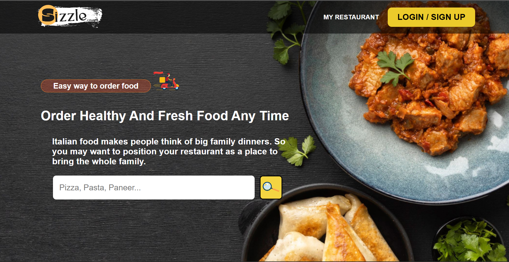
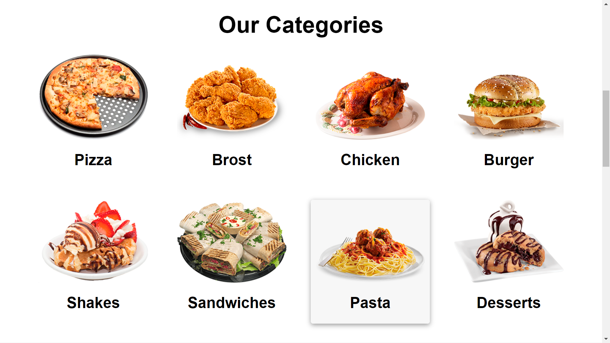
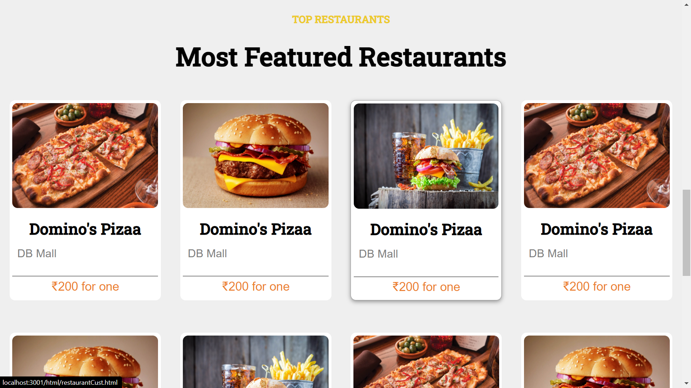
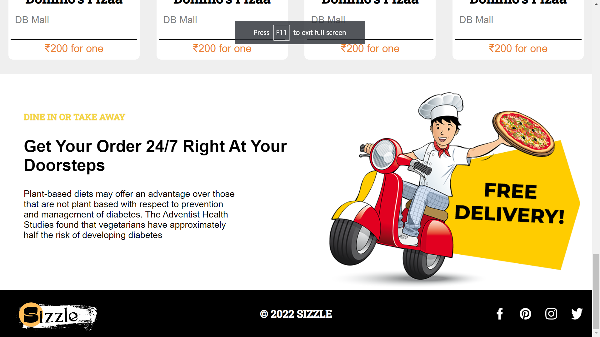
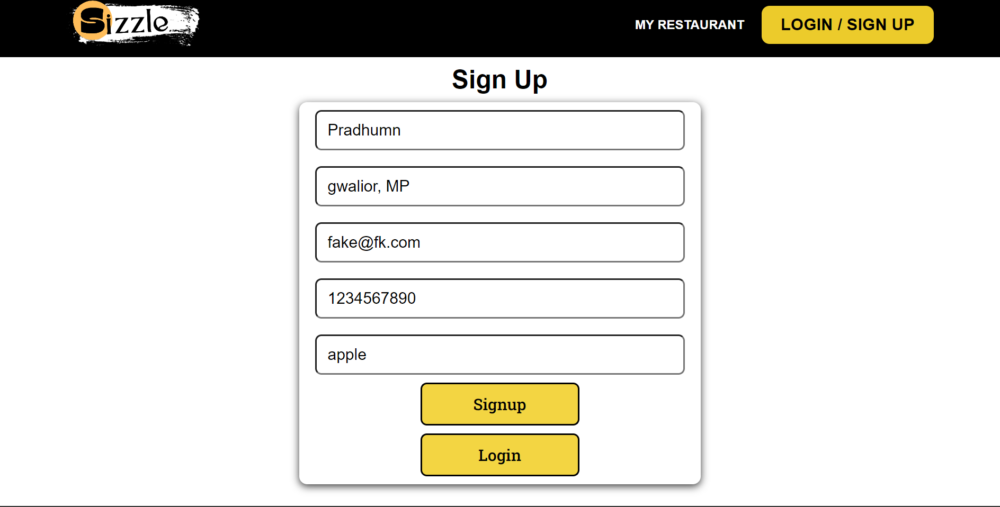
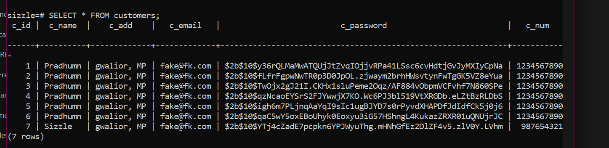
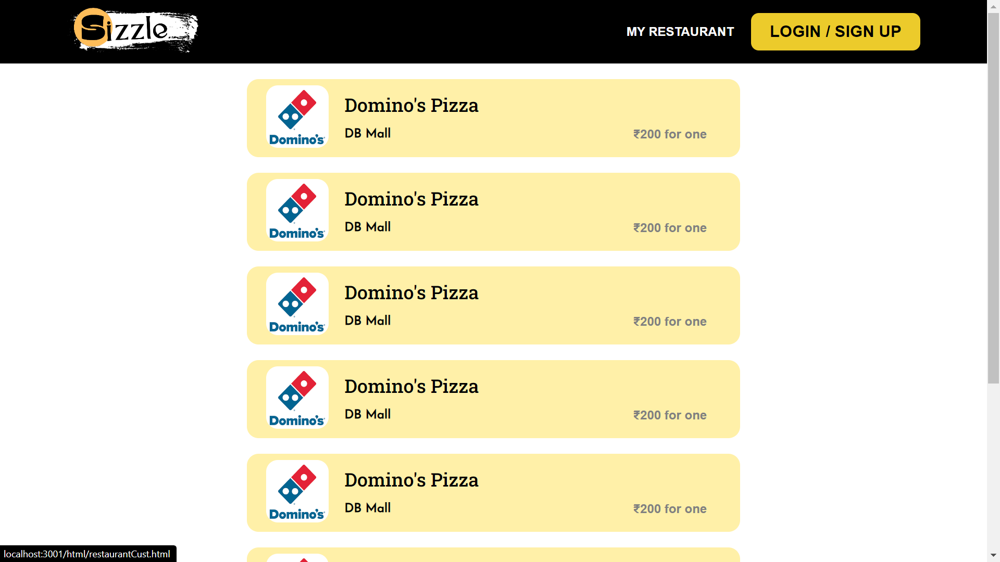
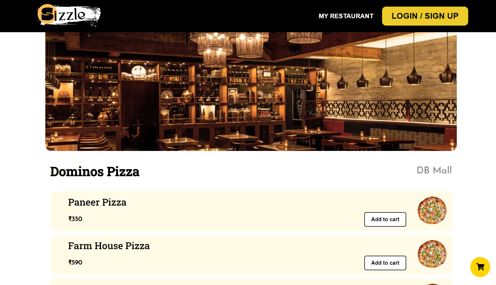
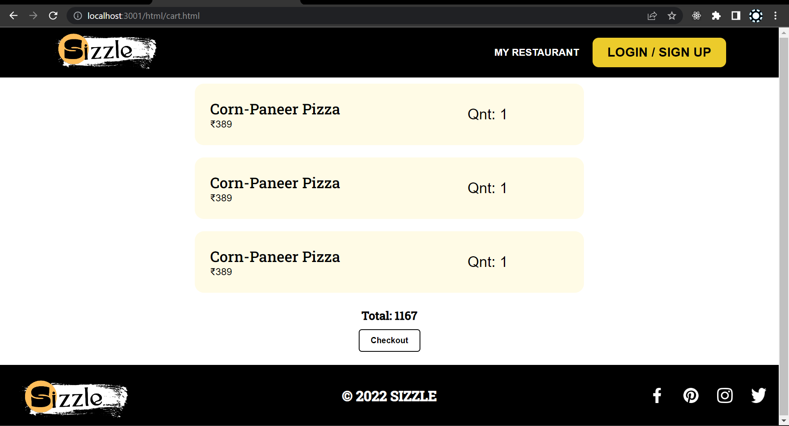
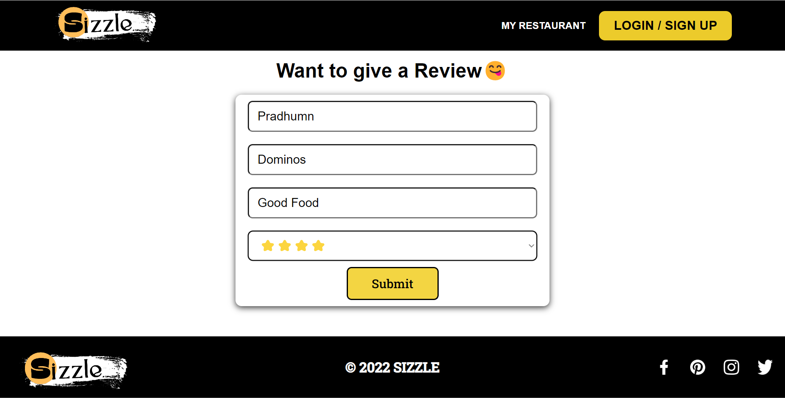
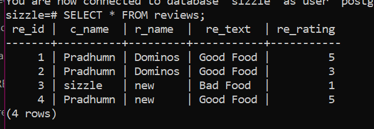
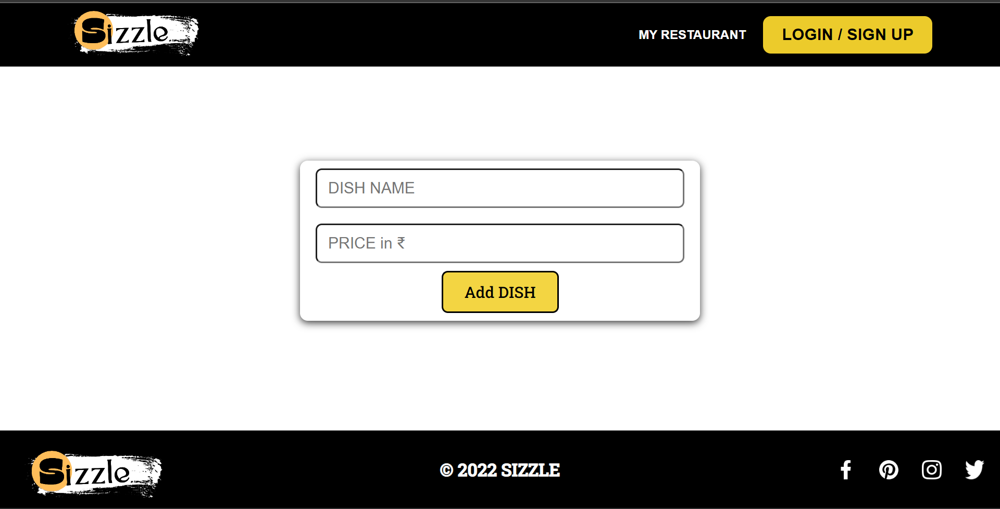

# Hosted URL

We have hosted our frontend as seperate repo at link:
https://pradhumnagarwal.github.io/Sizzlee/

# Technologies/Libraries/Packages Used

dotenv
express
path-module
expression-sessions
express-flash
bcrypt
passport
passport-local
HTML
CSS
JS
pg

# Local Setup

We need to Create a local POSTGRES DATABASE and give all the credentials in .env file.
To initiate the server need to run server.js in root folder, or just write command 'npm run start'.

# Team Members

Abhishek Sinha 2021-IMG-002
Anushka Pawar 2021-IMG-039
Pradhumn Agarwal 2021-IMG-040
